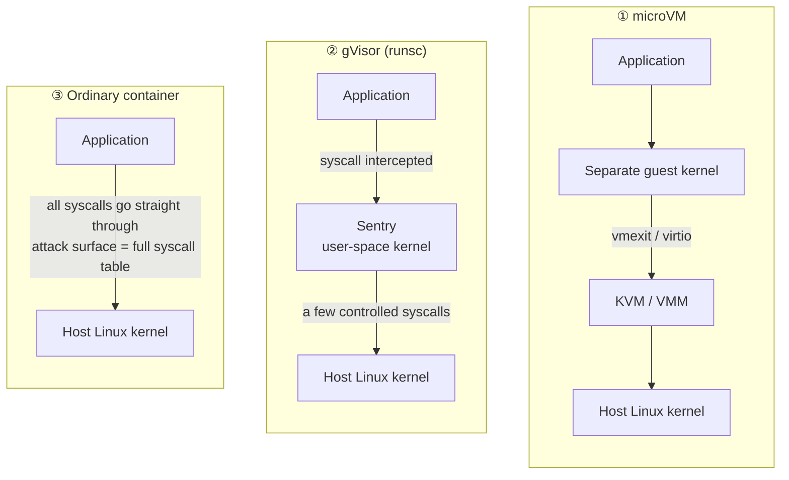
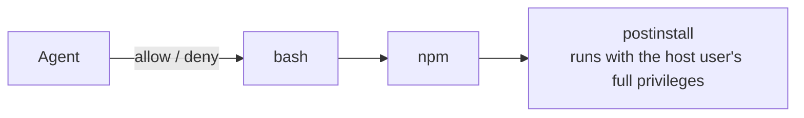
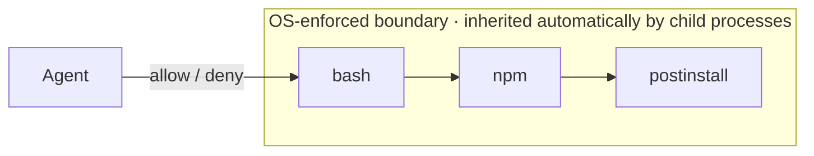
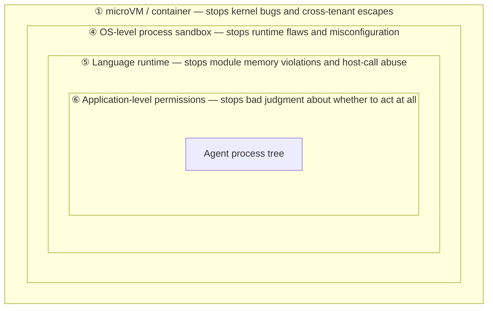

> **Last updated: 2026-08-23**
>
> This started from [this primer on agent sandbox mechanisms](https://zhuanlan.zhihu.com/p/2030970364650574071) and a round of ChatGPT discussion around it (see References at the end).
>
> **A note on shelf life**: the classification framework here (①–⑥) rests on foundational OS and virtualization mechanisms and won't change any time soon. But the underlying implementations of the cloud services in Section 6, "Where products land," iterate fast — check each vendor's latest documentation before making a decision.

## What this article covers

AI agents are already executing code of uncontrollable provenance in two places at scale: developers' own machines, and the cloud sandbox services offered by various vendors. A single `npm install` is enough for some dependency's postinstall script to read your entire home directory under your identity — **and "just put the agent in a sandbox" maps, in engineering terms, onto six technologies of wildly differing strength**, from handing it a virtual machine with its own kernel, all the way down to blocking nothing at all and merely asking you before it runs.

Conflating them is the single most common error in today's agent security discussions. This article places all six on one axis and works through them layer by layer.

**What you'll walk away with:**

| What you get | Section |
| --- | --- |
| One ordering axis that lets you compare all six, plus a cheat sheet | Section 1 |
| Three key differences between agent scenarios and traditional sandboxes (branching process trees, credentials in scope, prompt injection) | Section 2 |
| Each of the six layers: mechanism, real boundary, cost, and representative work | Section 3 |
| A side-by-side comparison of all six, plus a list of representative open-source projects per layer | Sections 4 & 5 |
| Which layer Claude Code, Codex CLI, OpenCode, E2B, Modal, Daytona, Vercel Sandbox, and others land on | Section 6 |
| Which layer to pick in four typical scenarios, and how to build defense in depth | Section 7 |
| Three problems that no sandbox can solve | Section 8 |
| One-line explanations of 30 systems-level terms | Appendix I |

> Terms like namespace, cgroups, seccomp, Landlock, KVM, and VirtIO appear throughout. Every one of them gets a one-line explanation in **[Appendix I: Terminology cheat sheet](#glossary)** at the end — jump there whenever you hit an unfamiliar word without losing the thread.

---

## 1. The big picture: a six-layer cheat sheet

Everything here is ordered along one axis — **who enforces the security boundary** — from closest to the hardware to closest to the application:

```
Hardware virtualization → user-space kernel → host kernel → language runtime → the app itself
   Hardest to escape  ────────────────────────────────────────►  Easiest to escape
   Highest overhead   ◄────────────────────────────────────────  Lowest overhead
```

If you read only one table, read this one. Every section that follows expands one of its rows.

| # | Layer | Boundary enforced by | Representative technology | Representative products / services |
| :-: | --- | --- | --- | --- |
| ① | **microVM / traditional VM** | Hardware virtualization + separate guest kernel | Firecracker, Cloud Hypervisor, crosvm, Kata | E2B, Vercel Sandbox, Northflank, Fly.io |
| ② | **User-space kernel sandbox** | A syscall layer reimplemented in user space | gVisor (runsc / Sentry) | Modal, GKE Sandbox |
| ③ | **Containers / rootless containers** | Host kernel: namespaces + cgroups | Docker, containerd, Podman, Sysbox | Daytona (default), Cloudflare Sandboxes |
| ④ | **OS-level process sandbox** | Host kernel: LSM / seccomp / namespaces | bubblewrap, Landlock, seccomp-BPF, Seatbelt | Claude Code, Codex CLI |
| ⑤ | **Language / runtime sandbox** | The language runtime itself | WASM + WASI, V8 Isolate, Deno permission model | Cloudflare Workers, StackBlitz WebContainers |
| ⑥ | **Application-level approval** | The application itself — **not actually a boundary** | Tool permissions, approval broker | OpenCode, most agent frameworks |

Three things to read out of it:

- **The higher up, the harder the boundary is to escape**, at the cost of higher startup overhead and lower compatibility; the lower down, the lighter it is — and the easier to step around.
- **Boundaries from ① through ④ are inherited by child processes; ⑤ and ⑥ are not** — this is the single most decisive property in agent scenarios.
- **Layer ⑤ needs a caveat**: in terms of how thoroughly it denies by default it is actually very strong (a module has no system capabilities at all to begin with), but its trusted computing base is a user-space runtime, and it cannot control native child processes. So on the "who enforces the boundary" axis, it sits after the kernel and before the application.

---

## 2. Why agent sandboxing isn't just an old problem restated

Sandboxing is an old craft. Browsers, mobile apps, and CI runners all solve the same question: *what is the most this untrusted code can do?* But agents introduce three new variables, and those three are exactly why the off-the-shelf answers fall short.

### 1. What's being constrained isn't one piece of code — it's a branching process tree

A traditional sandbox faces a known binary. An agent faces a chain like this:

```
agent → bash → npm install → postinstall script → arbitrary native program
```

The agent itself has no idea what will run at step four. That means **any constraint applied only to the first level is useless** — the boundary must be inheritable by child processes, and inheritance is precisely what application-level approval cannot do and only the operating system can.

### 2. Credentials are inherently in scope

An agent needs to push code and call cloud APIs, so GitHub tokens and cloud credentials must be within reach. That leads to an awkward conclusion: however elegant your filesystem isolation is, once the token is in an environment variable, the leak has already happened — **the attacker doesn't need to escape at all**.

```bash
docker run --rm \
  -v "$HOME:/host-home" \
  -e GITHUB_TOKEN="$GITHUB_TOKEN" \
  some-image        # the sandbox is meaningless here: you handed over your home directory and token yourself
```

### 3. The threat model now includes prompt injection

The attacker no longer needs to attack the kernel; they attack the model's judgment, getting the agent to do harmful things voluntarily and *entirely within its legitimate permissions*. This class of attack is transparent to every isolation layer — what the sandbox sees is one permitted file write and one permitted network request.

> **The core claim of this article**
>
> No single technology covers all three. The industry consensus is not "pick the strongest one" but **defense in depth** — these six layers aren't competitors, they're different gradations on one axis, and real products stack them.

---

## 3. The six layers, one at a time

Working down the axis established above, starting with the heaviest layer: what each one does, where its boundary is drawn, what it costs, and the representative work at that layer.

### ① microVMs and traditional VMs: give it its own kernel

> `Hardware virtualization · separate guest kernel`

This is the heaviest and hardest layer. Traditional VMs and microVMs use **exactly the same isolation principle** — KVM / Hyper-V / Apple Virtualization Framework plus a separate guest kernel. The only difference is how far the virtual machine model has been trimmed down.

| Dimension | Traditional VM | microVM |
| --- | --- | --- |
| **Design goal** | Emulate a complete computer | Host a single workload |
| **Device model** | BIOS/UEFI, PCI, ACPI, GPU, USB, audio, hotplug | vCPU, memory, block device, NIC, serial/vsock, only essential VirtIO |
| **Code size** | QEMU, on the order of 2 million lines | Firecracker, on the order of 100 thousand lines |
| **Boot time** | Seconds | Milliseconds to sub-second |
| **Lifecycle** | Long-running | Created and destroyed on demand |
| **Representative implementations** | QEMU/KVM, VMware, Hyper-V, Parallels | Firecracker, Cloud Hypervisor, crosvm, libkrun, QEMU `microvm` |

QEMU itself offers a `microvm` machine type: no PCI and no ACPI, optimized for fast boot with short-lived guests, and correspondingly without hotplug and other general-purpose VM features.

> **"micro" doesn't mean small configuration**
>
> Giving a traditional QEMU VM just 1 vCPU and 128 MB of RAM **does not turn it into a microVM** — it still has a BIOS, a PCI bus, ACPI, and a general-purpose machine model. What's been trimmed is the VMM, the virtual machine model, and the guest boot path — not the resource quota.

Nor can you simply declare that microVMs are always more secure than traditional VMs. The attack surface really is smaller (fewer virtual devices → less device emulation code → fewer guest-host interaction points), but actual security still depends on the quality of the VMM implementation, the device configuration, and the privileges of the host process. **Firecracker's documentation explicitly states that it does not filter the guest's outbound traffic**, requires network policy at the host layer, and recommends continuing to constrain the VMM process itself with jailer, seccomp, cgroups, and namespaces.

**How cold start gets squeezed to ~100 ms**: not by "a faster-booting kernel" but by a **pool of pre-warmed snapshots** — a batch of VMs is booted to ready state in advance and memory-snapshotted, and incoming requests restore from a snapshot rather than booting a kernel from scratch. This is the key to sub-second times at services like E2B.

**One thing that's often miscategorized**: Kata Containers. Its delivery interface is a container (OCI / containerd / Kubernetes), but its underlying security boundary is a lightweight VM — the accurate term is *VM-backed container*. Apple's `container` on macOS is in the same family (one lightweight VM per container). Evaluate any solution by separating "management interface" from "security boundary" and you won't confuse the two.

---

### ② gVisor: move the kernel into user space

> `User-space application-kernel sandbox`

gVisor takes a third path, distinct from both containers and VMs — it neither shares the host kernel nor boots a guest kernel. Its core technique is **syscall interception plus user-space reimplementation**: syscalls issued by the application are not passed straight to the host kernel but first interpreted and handled by `Sentry`, a user-space kernel written in Go.

The three paths differ in only one respect: **how many hops remain between the application and the host kernel, and how wide the last hop is.**



There are three components: **Sentry** (the user-space application kernel, handling syscalls, memory, signals, and threads), **Gofer** (which proxies the sandbox's access to the host filesystem), and **runsc** (an OCI-compatible runtime that drops in for `runc` in Docker / containerd / Kubernetes).

- **Versus seccomp**: seccomp only does allow/deny; gVisor *implements and services* a large portion of the Linux syscalls itself.
- **Versus microVMs**: no guest kernel is booted and no virtual hardware is emulated — even though some execution modes internally borrow KVM for address-space switching, architecturally it is still not a virtual machine.
- **The cost**: syscall-heavy workloads (lots of small-file I/O, frequent forks) show noticeable overhead; Linux ABI coverage is incomplete, so compatibility is weaker than containers or VMs.

**Commercial deployments**: Google Cloud Run / GKE Sandbox were the earliest large-scale users; on the AI side the canonical example is **Modal** — per its public documentation, Modal's sandboxes are built on gVisor containers with additional custom syscall filtering.

---

### ③ Containers and rootless containers

> `Namespaces + cgroups · shared host kernel`

Classic container isolation, whose defining property is a **shared host kernel**. Rootless mode (Podman, rootless Docker) does UID mapping via user namespaces: `id` inside the container shows `uid=0(root)`, but that's only a root mapped within the namespace — on the host it's still an ordinary user.

```
UID in container      UID on host
   0        ──►     1000     ← "root" inside the container
   1        ──►   100000
   2        ──►   100001

Host /root/secret.txt (root-readable only) → still unreadable by root inside the container
```

Its benefit can be stated precisely in one sentence: it downgrades the worst case from `escape → host root` to `escape → ordinary host user`.

> **Two common misconceptions**
>
> **Rootless ≠ `docker run --user 1000`**. The latter only changes the UID of the application inside the container; the Docker daemon and runtime still run as host root, and mounting, networking, and other low-level operations are still done by root.
>
> **"Escaping to an ordinary user" is still severe.** An ordinary user can read your source code, SSH private keys, browser credential stores, and cloud CLI configs — on a developer machine, that's very nearly everything of value.

Rootless answers exactly one question: *what identity do the runtime and container processes actually have on the host?* It does not address kernel vulnerabilities, leakage through already-mounted files, token exfiltration, prompt injection, or resource exhaustion.

**Representative work at this layer**: `Docker` / `containerd` / `runc`, `Podman` (natively rootless), `RootlessKit`, `Sysbox` (an enhanced runc that lets you safely run Docker/systemd inside a container); plus `isolate` from the competitive-judging world — the foundation under online judges like Judge0 and Piston, a lightweight implementation from the same family.

---

### ④ Policy-driven OS-level process sandboxes

> `Policy-driven OS-level process sandbox`

No container, no virtual machine — just OS primitives constraining a native process **and all of its descendants**. This is the mainstream approach for local CLI agents today, because its compatibility cost is close to zero: your `git`, `cargo`, and `pnpm` all work as usual.

Structurally it always has three layers. These layers have standard names in the security field, and it's worth using the precise terms in architecture documents:

| Layer | Responsibility | Term of art |
| --- | --- | --- |
| **Sandbox policy** | Declares readable/writable paths, reachable domains, operations requiring approval | `policy ruleset` |
| **Policy engine** | Makes the decision, handles approval exceptions | `PDP` · approval broker |
| **Enforcement backend** | The kernel actually blocks out-of-bounds behavior | `PEP` |

> Linux Landlock's official documentation uses the word `ruleset` directly. Terms like "rulebook" or "rules engine" aren't standard; splitting the concept into these three layers is far more precise.

The enforcement layer splits by platform, which is the biggest engineering burden of this approach — one policy must express identical semantics across three completely different kernel mechanisms:

| Control target | Linux | macOS | Windows |
| --- | --- | --- | --- |
| **File read/write** | Landlock, mount namespaces, bubblewrap | Seatbelt (App Sandbox / `sandbox-exec`) | AppContainer, restricted tokens |
| **System calls** | seccomp-BPF | — | — |
| **Resource quotas** | cgroups | — | Job Objects |
| **Network egress** | Network namespace + egress proxy | Egress proxy | Egress proxy |

Note that Landlock and bubblewrap work differently: the former is an LSM (kernel-enforced mandatory access control), while the latter is based mainly on mount and user namespaces — and the two are often used together.

**Representative open-source tools at this layer**: `bubblewrap` (the sandbox foundation under Flatpak), `nsjail` (Google), `minijail` (ChromeOS), `Firejail`, the Linux `Landlock` LSM, and `seccomp-BPF`; on macOS, `sandbox-exec` / Seatbelt profiles; on Windows, AppContainer and restricted tokens.

> **An easily overlooked boundary**
>
> Sandboxes of this kind typically **constrain only Bash commands and their child processes**. An agent's built-in Read / Edit / Write tools go through the application-level permission system and sit outside the OS sandbox. So the complete description is a two-layer structure — "**application-level permission system + OS-level Bash process sandbox**" — not a blanket "it has a sandbox."
>
> The other escape hatch is `unsandboxed retry`: a command can be retried outside the sandbox after user approval. To treat this as a strict boundary you must close that channel, and make sandbox initialization failure terminate outright rather than silently degrade.

---

### ⑤ Language and runtime sandboxes

> `WASM · WASI · V8 Isolate · Deno`

From this layer down, the boundary's enforcer shifts from the kernel to a **user-space language runtime** — and what it isolates is no longer a process but a **code module**. There's a fundamental dividing line between it and the four layers above:

| | **deny by policy**<br/>①–④ containers / OS sandboxes | **deny by construction**<br/>⑤ WASM / capabilities |
| --- | --- | --- |
| **Starting point** | The process has all OS capabilities by default | The module has zero system capabilities by default |
| **Approach** | Subtract permissions rule by rule | The host grants capabilities explicitly, one at a time |
| **Typical rules** | `deny ~/.ssh`, `deny /etc`, `deny raw socket`, … | `workspace directory fd`, `stdout`, `read-only API capability` |
| **Failure mode** | **One missing rule = one hole** | **One overly broad host interface = one hole** |
| **Compatibility** | Existing toolchains work as-is | Code must be recompiled / restricted to certain languages |

The left column's security depends on how complete your rules are; the right column's on how small your host interface is. The former is compatible with existing toolchains, the latter requires recompilation — **and the hard requirements of agent scenarios push you toward the left.**

#### WASM is a sandbox in its own right

A common misconception is that "WASM only runs in the browser, and WASI is what makes it a sandbox." Both halves are wrong.

WASM is a portable binary instruction format that runs in browsers (V8 / SpiderMonkey / JSC), on servers (Wasmtime / Wasmer / WasmEdge), at the edge, and on embedded devices — but **it needs a runtime in every environment**; it isn't handed straight to the OS the way an `.exe` is.

And WASM Core itself has well-defined sandbox properties, academically classified as *software fault isolation*: linear memory bounds checking, instruction and control-flow validation, no ability to read host process memory, and — most importantly — **it has no syscall instruction at all**.

So WASI's role is precisely the opposite: **it expands permissions**. Pure WASM can only compute; only with WASI can it touch files and the network. WASI's value is in standardizing the host interface and adopting capability-oriented security — unforgeable handles like preopened directory handles and network capabilities. The relationship among the three is best stated this way:

```
WASM Core   defines how computation is executed safely
WASI        defines how system resources are accessed under control
Runtime     implements and enforces both   ← the real security boundary is here
```

**Representative work**: runtimes include `Wasmtime` (Bytecode Alliance), `Wasmer`, and `WasmEdge`; plugin frameworks include `Extism`; on the serverless side there's Fermyon `Spin`. The extreme in-browser case is **StackBlitz WebContainers** — the entire Node.js runtime compiled to WASM so that `npm install` runs inside a browser tab; the Python counterpart is `Pyodide`.

> **Misconfiguration breaks it just as thoroughly**
>
> If the host provides `preopen("/")` plus `network: allow-all`, the module hasn't escaped any memory boundary — it has simply been *legitimately granted* the whole filesystem and the network. Likewise, if the host exports a `host_exec_shell(cmd)`, WASM's security boundary is decorative — it can only restrict the module to the interfaces the host exposes; it cannot fix an overly broad interface design.

#### Deno: a permission-based language runtime sandbox

Deno is a *permission-based language runtime sandbox*, secure by default, with permissions enforced by the Deno runtime rather than the OS:

```bash
deno run \
  --allow-read=./data \
  --allow-write=./output \
  --allow-net=api.example.com \
  main.ts
```

But it has two fatal escape hatches that must be sealed when running untrusted code:

- Native child processes created via `--allow-run` **do not inherit** Deno's permission model; they run with the full privileges of the host user.
- Native dynamic libraries loaded via `--allow-ffi` run in the same process and issue syscalls directly, completely bypassing the JS permission checks.

These two holes are exactly what defines this layer: **a runtime can control the code it interprets, but not the native processes that code spawns.**

Also, don't conflate Deno's two "sandboxes": `deno run --allow-*` is the runtime permission model, whereas the `deno sandbox` service is an official **Linux microVM** for running untrusted code — that belongs to category ①.

#### V8 Isolate: multi-tenancy inside a single process

A more extreme commercial form of the same family is the **V8 Isolate** — Cloudflare Workers and Deno Deploy both fall here. It isolates multiple tenants within one process with near-zero cold start, at the cost of only supporting JS/WASM and having the entire V8 engine as its trusted computing base. The extreme performance it buys comes from turning "a shared kernel" into "a shared process."

---

### ⑥ Application-level approval: not actually a sandbox

> `Application-level permission / approval system`

It sits at the lightest end because it doesn't constitute a security boundary at all — but it's the one most often mistaken for one, so it deserves its own section.

The mechanism is simple: an `allow / ask / deny` decision before a tool call. It answers "**should this run**," and once it's allowed, the command runs with the host user's full privileges, with no further constraint from the OS.

**With application-level approval only — approval happens on exactly one edge:**



**Add layer ④'s OS-enforced boundary, and the boundary follows the whole process tree:**



Approval is the policy decision point (PDP); the OS sandbox is the policy enforcement point (PEP). **With a PDP but no PEP, the security model ends at the first `spawn`.** Note that in the second diagram the agent process itself sits outside the boundary — that's the common shape in real products.

> **Representative implementation**
>
> **OpenCode**'s official security documentation puts it bluntly: *OpenCode does not sandbox the agent.* What it offers is application-level tool permissions and human approval; when real isolation is needed, the docs recommend wrapping it in Docker or a VM yourself. The tool permission layer in the vast majority of agent frameworks falls in this same category.
>
> This isn't to say approval is useless — it's an indispensable part of defense in depth. It just governs *intent*, not *capability*.

---

## 4. All six layers in one table

| Layer | Boundary enforced by | Inherited by children | Protects against kernel bugs | Compatible with existing toolchains | Startup overhead |
| --- | --- | :---: | :---: | :---: | :---: |
| **① microVM / VM** | Hardware virtualization + guest kernel | ✓ | ✓ | Full | Sub-second to seconds |
| **② gVisor** | Sentry, a user-space kernel | ✓ | Greatly reduced | Incomplete ABI | ~100 ms |
| **③ Container / rootless** | Kernel (namespaces + cgroups) | ✓ | Reduces impact | High | ~100 ms |
| **④ OS process sandbox** | Kernel (LSM / seccomp / namespaces) | ✓ | ✗ | Full | Effectively none |
| **⑤ Language runtime** | Runtime (WASM / V8 / Deno) | Same language only | ✗ | Requires recompilation | Effectively none |
| **⑥ Application-level approval** | The application itself | ✗ | ✗ | Full | None |

The "inherited by children" column is usually the decisive one in agent scenarios — it directly determines whether an `npm install` postinstall script is governed. That is precisely the step between ④ and ⑤/⑥.

---

## 5. Representative work by layer

Open-source components sorted into their layers, so you can look them up directly when choosing:

| Layer | Representative open-source projects |
| --- | --- |
| **① microVM / VM** | `Firecracker` (AWS), `Cloud Hypervisor`, `crosvm` (ChromeOS), `libkrun`, `QEMU microvm`, `Kata Containers`, Apple `container` |
| **② User-space kernel** | `gVisor` (runsc + Sentry + Gofer) |
| **③ Container / rootless** | `runc`, `containerd`, `Docker`, `Podman`, `RootlessKit`, `Sysbox`, `isolate` (the judging sandbox under Judge0 / Piston) |
| **④ OS-level process sandbox** | `bubblewrap` (Flatpak's foundation), `nsjail` (Google), `minijail` (ChromeOS), `Firejail`, the Linux `Landlock` LSM, `seccomp-BPF`, macOS `sandbox-exec` (Seatbelt), Windows AppContainer |
| **⑤ Language / runtime** | `Wasmtime`, `Wasmer`, `WasmEdge`, `Extism`, Fermyon `Spin`, `WebContainers`, `Pyodide`, `Deno`, V8 `Isolate` |

---

## 6. Where products land: who uses which layer

### Cloud agent sandbox services

| Service | Isolation layer | Underlying technology |
| --- | --- | --- |
| **E2B** | ① microVM | Firecracker, pre-warmed snapshot pool, ~150–200 ms cold start |
| **Vercel Sandbox** | ① microVM | Firecracker, separate kernel + separate filesystem + network namespace per sandbox |
| **Northflank** | ① microVM | Firecracker |
| **Fly.io Machines** | ① microVM | Firecracker |
| **Modal** | ② User-space kernel | gVisor containers + custom syscall filtering |
| **Daytona** | ③ Container (upgradable) | Docker by default, with Kata or Sysbox as options for stronger isolation |
| **Cloudflare Sandboxes** | ③ Container | Containerized execution, cold start as low as tens of milliseconds |
| **Cloudflare Workers** | ⑤ Isolate | V8 Isolate, multi-tenant within a single process |
| **StackBlitz WebContainers** | ⑤ WASM | Node.js compiled to WASM, running entirely in the browser |

One rule of thumb: **services handling GPU training/inference workloads lean toward ② or ③** (device passthrough is easier), while **those doing pure code execution lean toward ①** (harder isolation, and cold start can be squeezed down with snapshots).

### Local agent tools

| Product | Precise classification | Actual enforcement mechanism |
| --- | --- | --- |
| **Claude Code** | Application-level permissions + policy-driven OS-level process sandbox (⑥ + ④) | macOS Seatbelt; bubblewrap on Linux/WSL2; network via an egress proxy outside the sandbox with a domain allowlist; optional seccomp |
| **Codex CLI** | Same as above | macOS Seatbelt; Landlock + seccomp on Linux |
| **OpenCode** | Application-level permissions / approval system only (⑥) | No OS-enforced boundary; the docs recommend wrapping it in Docker or a VM yourself |

The most noteworthy thing across these three rows is the difference between Claude Code and OpenCode: both have an approval layer; the difference is whether anything still governs a command *after* it has been approved.

> **A useful corollary**
>
> If you need to bring an agent that **has no sandbox of its own** (say, OpenCode launched via ACP) under control, you don't need to hook its shell commands one by one. Satisfy four conditions — the agent process itself starts inside the sandbox, it cannot spawn processes that escape the sandbox, all privileged capabilities must go through a host-side broker, and no high-privilege IPC such as the Docker socket is exposed — and the constraint propagates naturally to the whole process tree.
>
> The division of responsibility is then very clear: **application-level permissions govern "should this run"; the outer sandbox governs "what's the most it can do once it runs."**

---

## 7. How to choose: four typical scenarios

| Scenario | Characteristics | Recommendation |
| --- | --- | --- |
| **A. Local single user running build scripts for your own project** | The threat comes mainly from the dependency supply chain and the agent's own mistakes; you needn't assume someone is actively attacking the kernel | **④ OS-level process sandbox**, best compatibility |
| **B. Executing third-party or model-generated untrusted code** | Code provenance is uncontrolled but it's still single-tenant, and some startup overhead is acceptable | Stack on **③ rootless containers or ② gVisor** |
| **C. Multi-tenant cloud, must assume code actively exploits kernel bugs** | One escape affects other tenants; the boundary must be hardware-level | **① microVM**, one instance per session, destroyed after use |
| **D. Plugin system that can be restricted to pure computation or pure JS** | No need to invoke native toolchains; recompilation or language restriction is acceptable | **⑤ WASM + WASI**, or Deno (with run / ffi disabled) |

But real production setups are usually not a single choice — they're a stack. Each layer stops something different:



Defense in depth isn't "buy a few extra insurance policies" — **each layer corresponds to a specific failure mode the other layers cannot cover**. The number of layers should be determined by your threat model; more is not automatically better.

---

## 8. Three things no sandbox layer will fix

Stack all six layers and three problems remain exactly where they were. These are the genuinely open frontier of agent sandboxing.

### 1. Credential exposure

No isolation layer can do anything about *what you hand over voluntarily*. The only real answer is to keep the token out of the sandbox entirely and have a host-side **credential broker** proxy signing and pushing — the agent receives a one-shot, scope-limited result of an operation, not the credential itself.

### 2. Outbound data exfiltration

Filesystem isolation doesn't stop the network. The only effective control today is a **deny-by-default egress proxy with a domain allowlist**, and it must be deployed outside the sandbox — proxy configuration inside the sandbox can be changed by the processes inside it.

### 3. Prompt injection

It happens entirely within authorized scope and is transparent to every sandbox layer. All you can do is minimize capabilities, require human approval for irreversible operations, and keep a complete audit trail — the goal isn't prevention but limiting the blast radius.

---

## Closing

> On the isolation-mechanism side, the technology is quite mature and cleanly layered. The genuinely hard problems in agent sandboxing are credential brokering, egress policy, and semantic-layer attacks — and none of those three is solved by swapping in a stronger layer of isolation.

So when making a technology choice, it's worth asking a prior question: **how does your token get into the sandbox, and where does your outbound traffic go?** The answers to those two usually matter more to real-world security than "container or microVM."

---

<a id="glossary"></a>

## Appendix I: Terminology cheat sheet

The systems-level terms mentioned above, one line each, grouped by layer.

### Kernel mechanisms (Linux)

| Term | One-line explanation |
| --- | --- |
| **syscall (system call)** | The only entry point through which a user-space program asks the kernel to do work — `open`, `read`, `connect` all qualify. How strong a sandbox is largely comes down to how many syscalls it can intercept. |
| **namespace** | Gives a group of processes an independent view of the system. Varieties include mount (filesystem), PID (process IDs), net (network stack), and user (user IDs); containers are a combination of them. |
| **User namespace** | One of the above, responsible for UID mapping: `uid=0` inside a container can map to an ordinary user on the host. The foundation of rootless containers. |
| **cgroups** | Control groups: limit and account for how much CPU, memory, I/O, and how many processes a group of processes can use. Governs "how much," not "what you can touch." |
| **seccomp / seccomp-BPF** | Attaches a syscall allowlist/denylist to a process; violations either kill it or return an error. Only allow/deny; it doesn't change call semantics. |
| **LSM (Linux Security Module)** | The kernel's mandatory access control framework, inserting check hooks at key operation points. SELinux, AppArmor, and Landlock are all implementations of it. |
| **Landlock** | An LSM that lets an **unprivileged process** attach a file/network access ruleset to itself and its descendants — one that can only be tightened, never loosened. |
| **Linux capabilities** | Slices root's privileges into fine-grained pieces like `CAP_NET_ADMIN` and `CAP_SYS_ADMIN`. ⚠️ A different concept from "capability-based security" below — they merely share a name. |

### Sandboxing tools

| Term | One-line explanation |
| --- | --- |
| **bubblewrap (bwrap)** | An unprivileged sandbox launcher that uses namespaces to build a minimal environment with only the specified directories mounted. The sandbox foundation under Flatpak. |
| **nsjail / minijail / Firejail** | Similar process sandboxing tools — from Google, ChromeOS, and the community respectively — that combine namespaces, seccomp, and cgroups. |
| **Seatbelt / `sandbox-exec`** | macOS's sandbox mechanism, using a Scheme-style profile to declare which files and network a process may access. |
| **AppContainer / restricted token** | The Windows counterpart, limiting the resources a process can reach via lowered-privilege tokens and capability SIDs. |
| **Job Objects** | The Windows mechanism for limiting resource usage across a group of processes, analogous to cgroups. |

### Containers

| Term | One-line explanation |
| --- | --- |
| **OCI** | Open Container Initiative — the industry standard for container image formats and runtimes. OCI-compliant runtimes are interchangeable. |
| **runc** | The most widely used OCI runtime — the program that actually calls namespaces/cgroups to bring a container up. |
| **containerd** | The container lifecycle management daemon, sitting between Docker/Kubernetes and runc. |
| **Rootless** | The entire chain (daemon, runtime, container processes) runs as an ordinary user, with no host root required. |

### Virtualization

| Term | One-line explanation |
| --- | --- |
| **Hypervisor / VMM** | The virtual machine monitor, responsible for creating VMs, emulating virtual devices, and scheduling vCPUs. QEMU and Firecracker are both VMMs. |
| **KVM** | The virtualization module built into the Linux kernel that exposes the CPU's hardware virtualization capabilities to a VMM. |
| **Guest kernel** | The VM's own OS kernel, entirely separate from the host kernel — exactly why VM-class isolation is the hardest. |
| **VirtIO** | The standardized paravirtualized device interface (disk, NIC, etc.) between VM and host, far faster than emulating real hardware. |
| **vsock** | A socket channel between VM and host that bypasses the network stack, commonly used to deliver commands into the guest. |
| **vmexit** | The trap out to the VMM when the guest executes an instruction requiring host involvement — one of the main sources of VM performance overhead. |
| **jailer** | Firecracker's bundled helper that confines the VMM process itself using namespaces, cgroups, and seccomp. |

### General security concepts

| Term | One-line explanation |
| --- | --- |
| **TCB (trusted computing base)** | The sum of the code that security depends on. Smaller is better — a bug in it invalidates the entire boundary. |
| **PDP / PEP** | Policy decision point / policy enforcement point. The former decides "is this allowed"; the latter does the actual blocking. Neither works without the other. |
| **Egress proxy** | A proxy that all outbound traffic must pass through, with a domain allowlist. Currently the only effective defense against data exfiltration. |
| **capability-based security** | A process has no ambient authority by default and can only use the unforgeable resource handles the host explicitly hands it (such as an already-opened directory fd). |
| **SFI (software fault isolation)** | Confining untrusted code to a designated memory and control-flow range through software-level checks and a restricted execution model. WASM belongs to this category. |
| **Linear memory** | The single contiguous block of memory a WASM module can access; every access is bounds-checked, and going out of bounds traps. |
| **preopen** | WASI's authorization mechanism: the host opens a directory in advance at instantiation time and hands the handle to the module, which can only operate under that handle. |

---

## Appendix II: Chinese–English terminology mapping

Several Chinese phrases used here have no settled standard translation; these are the correspondences adopted in this article:

| Chinese | English |
| --- | --- |
| 策略驱动的 OS 级进程沙箱 | policy-driven OS-level process sandbox |
| 用户态内核沙箱 | user-space application-kernel sandbox |
| 能力安全 | capability-based security |
| 权限型语言运行时沙箱 | permission-based language runtime sandbox |
| 软件故障隔离 | software fault isolation (SFI) |
| VM 支撑的容器 | VM-backed container |

Phrasings like "rulebook" and "rules engine" aren't standard terms in the security field; in documentation, prefer splitting the idea into the three layers `policy ruleset`, `policy engine`, and `enforcement backend`.

---

## References

- A primer on agent sandbox mechanisms: <https://zhuanlan.zhihu.com/p/2030970364650574071?share_code=zzB8zsEB4BXv&utm_psn=2031157537924453386>
- ChatGPT discussion (rootless, terminology distinctions, VMs vs. microVMs, gVisor, Claude Code vs. OpenCode, WASM/WASI and Deno): <https://chatgpt.com/share/6a8acf66-2194-83ea-95fa-b429e62872fb>

Sources for the underlying implementations of cloud sandbox services (retrieved 2026-08):

- Modal, *Best microVM Sandboxes for AI Code Execution in 2026*: <https://modal.com/resources/best-microvm-sandboxes-ai-code-execution>
- Northflank, *Daytona vs Modal: comparing AI code execution sandboxes in 2026*: <https://northflank.com/blog/daytona-vs-modal>
- Developers Digest, *E2B vs Daytona vs Modal vs Cloudflare vs Vercel Sandbox*: <https://www.developersdigest.tech/blog/ai-agent-code-sandbox-comparison-2026>
- Spheron, *AI Agent Code Execution Sandboxes on GPU Cloud*: <https://www.spheron.network/blog/ai-agent-code-execution-sandbox-e2b-daytona-firecracker/>
- Blaxel, *Best Code Execution Sandboxes for AI Agents*: <https://blaxel.ai/blog/code-execution-sandboxes-for-ai-agents>