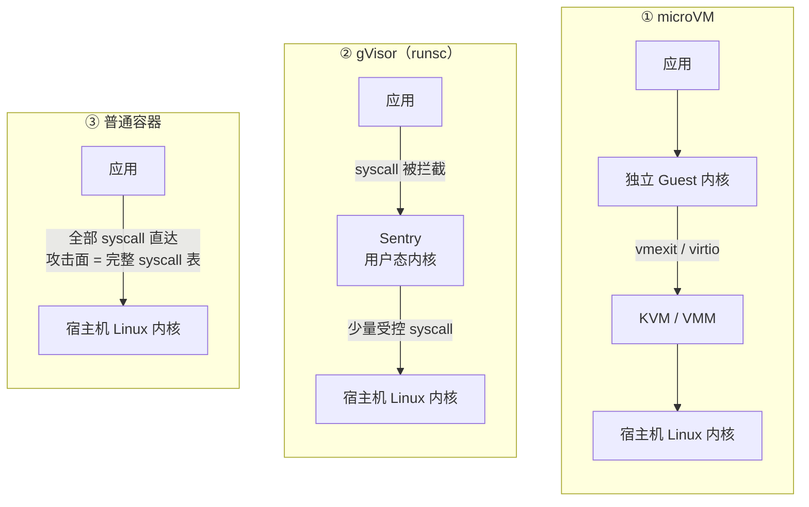
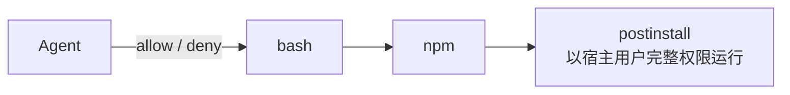
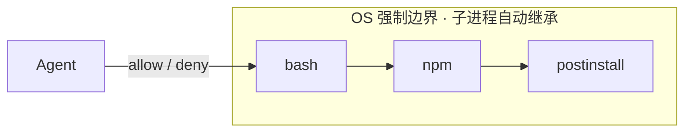
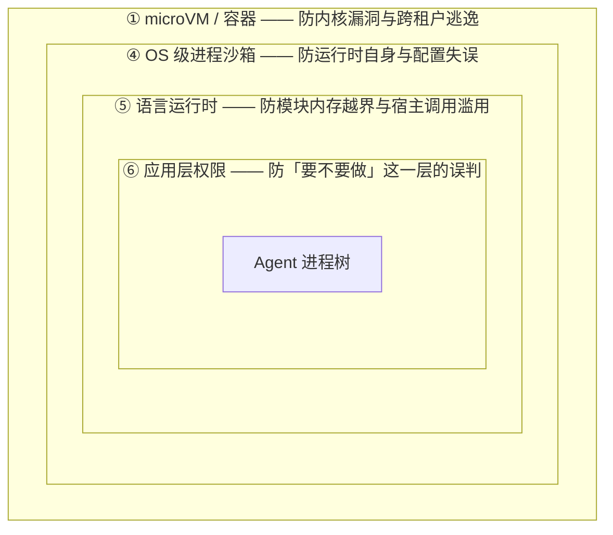

> **最后更新：2026-08-23**
>
> 起点是[这篇 Agent 沙箱机制浅析](https://zhuanlan.zhihu.com/p/2030970364650574071)，以及围绕它的一轮 ChatGPT 讨论（见文末 References）。
>
> **时效性说明**：本文的分类框架（①–⑥）建立在操作系统与虚拟化的基础机制上，短期内不会变；但第六节「产品落位」中各家云服务的底层实现迭代很快，选型前请以官方最新文档为准。

## 这篇文章讲什么

AI Agent 已经在两个地方大规模执行来源不可控的代码：开发者自己的机器，以及各家的云端沙箱服务。一条 `npm install` 就足以让某个依赖的 postinstall 脚本以你的身份读遍整个家目录——**而"给 Agent 加个沙箱"这句话，在工程上对应着六种强度差异极大的技术**，从给它一台带独立内核的虚拟机，到什么都不拦、只在执行前问你一句。

把它们混为一谈，是当前 Agent 安全讨论里最常见的错误。本文把这六种技术放到同一条轴上，逐层讲清楚。

**读完你会得到：**

| 你会得到 | 对应章节 |
| --- | --- |
| 一条能统一比较六种技术的排序轴，和一张速查表 | 第一节 |
| Agent 场景与传统沙箱的三点关键差异（进程树发散、凭证在场、Prompt Injection） | 第二节 |
| 六层隔离各自的机制、真实边界、代价与代表工作 | 第三节 |
| 六层横向对照，以及各层代表开源项目清单 | 第四、五节 |
| Claude Code、Codex CLI、OpenCode、E2B、Modal、Daytona、Vercel Sandbox 等分别落在哪一层 | 第六节 |
| 四种典型场景下该选哪一层，以及如何做分层纵深 | 第七节 |
| 三个换任何沙箱都解决不了的问题 | 第八节 |
| 30 条系统层术语的一句话解释 | 附录一 |

> 文中会出现 namespace、cgroups、seccomp、Landlock、KVM、VirtIO 等系统层名词。它们全部在文末 **[附录一：术语速查](#glossary)** 里有一句话解释，读到不熟的词随时可以跳过去，不影响主线阅读。

---

## 一、先看全局：六层隔离速查表

本文统一按一条轴排序——**安全边界由谁强制**，从离硬件最近排到离应用最近：

```
硬件虚拟化  →  用户态内核  →  宿主内核  →  语言运行时  →  应用自身
   最难绕过  ────────────────────────────────────────►  最易绕过
   开销最大  ◄────────────────────────────────────────  开销最小
```

如果只读一张表，就读这张。后面每一节都是对其中一行的展开。

| # | 层级 | 边界执行者 | 代表技术 | 代表产品 / 服务 |
| :-: | --- | --- | --- | --- |
| ① | **microVM / 传统 VM** | 硬件虚拟化 + 独立 Guest 内核 | Firecracker、Cloud Hypervisor、crosvm、Kata | E2B、Vercel Sandbox、Northflank、Fly.io |
| ② | **用户态内核沙箱** | 用户态重实现的 syscall 层 | gVisor（runsc / Sentry） | Modal、GKE Sandbox |
| ③ | **容器 / Rootless 容器** | 宿主内核：namespace + cgroups | Docker、containerd、Podman、Sysbox | Daytona（默认）、Cloudflare Sandboxes |
| ④ | **OS 级进程沙箱** | 宿主内核：LSM / seccomp / namespace | bubblewrap、Landlock、seccomp-BPF、Seatbelt | Claude Code、Codex CLI |
| ⑤ | **语言 / 运行时沙箱** | 语言运行时自身 | WASM + WASI、V8 Isolate、Deno 权限模型 | Cloudflare Workers、StackBlitz WebContainers |
| ⑥ | **应用层审批** | 应用自己——**其实不构成边界** | tool permission、approval broker | OpenCode、多数 Agent 框架 |

三条判读线索：

- **越靠上，边界越难绕过**，代价是启动开销上升、兼容性下降；越靠下越轻，但也越容易被越过。
- **① 到 ④ 的边界会被子进程继承，⑤ 和 ⑥ 不会**——这是 Agent 场景最有决定性的一条属性。
- **⑤ 的位置需要一点说明**：它在"默认拒绝"的彻底性上其实很强（模块默认没有任何系统能力），但它的可信计算基是一个用户态运行时，且管不住原生子进程。所以在"边界由谁强制"这条轴上，它排在内核之后、应用之前。

---

## 二、为什么 Agent 沙箱不是老问题的复读

沙箱本身是门老手艺。浏览器、移动应用、CI Runner 都在解决同一个命题：*这段不可信代码最多能做什么*。但 Agent 把三个新变量塞了进来，正是这三个变量让现成答案不够用。

### 1. 被约束的不是一段代码，是一棵会发散的进程树

传统沙箱面对的是一个已知二进制。Agent 面对的是这样一条链：

```
agent → bash → npm install → postinstall 脚本 → 任意原生程序
```

Agent 自己并不知道第四步会跑出什么。这意味着**任何只作用在第一层的约束都会失效**——边界必须能被子进程继承，而"继承"恰恰是应用层审批做不到、只有操作系统能做到的事。

### 2. 凭证天然在场

Agent 要 push 代码、调云 API，GitHub Token 和云凭证必须触手可及。这就带来一个尴尬结论：文件系统隔离做得再漂亮，只要 Token 进了环境变量，泄露就已经完成了——**攻击者根本不需要逃逸**。

```bash
docker run --rm \
  -v "$HOME:/host-home" \
  -e GITHUB_TOKEN="$GITHUB_TOKEN" \
  some-image        # 沙箱在这里毫无意义：你主动把家目录和 Token 递了出去
```

### 3. 威胁模型里多了 Prompt Injection

攻击者不再需要打内核，他打的是模型的判断力：让 Agent 在*完全合法的权限范围内*自愿做坏事。这类攻击对所有隔离层都是透明的——沙箱看到的是一次被允许的写文件、一次被允许的网络请求。

> **本文的基本判断**
>
> 没有任何单一技术能同时覆盖这三点。业界的共识解法不是"选一个最强的"，而是**分层纵深**——这六层不是竞品，是同一条轴上的不同刻度，实际产品都在做叠加。

---

## 三、六层隔离逐层拆解

下面按前面确立的那条轴，从最重的一层开始，逐层看它们的机制、边界画在哪里、代价是什么、以及各自的代表工作。

### ① microVM 与传统 VM：给它一个独立内核

> `Hardware virtualization · 独立 Guest 内核`

这是最重也最硬的一层。传统 VM 与 microVM 的**隔离原理完全相同**——都是 KVM / Hyper-V / Apple Virtualization Framework 加一个独立 Guest 内核。差别只在虚拟机器模型被裁剪到什么程度。

| 维度 | 传统 VM | microVM |
| --- | --- | --- |
| **设计目标** | 模拟一台完整计算机 | 承载单一工作负载 |
| **设备模型** | BIOS/UEFI、PCI、ACPI、GPU、USB、音频、热插拔 | vCPU、内存、块设备、网卡、串口/vsock，仅必要 VirtIO |
| **代码规模** | QEMU 约 200 万行量级 | Firecracker 约 10 万行量级 |
| **启动时间** | 秒级 | 毫秒 ~ 亚秒级 |
| **生命周期** | 长期运行 | 随用随毁 |
| **代表实现** | QEMU/KVM、VMware、Hyper-V、Parallels | Firecracker、Cloud Hypervisor、crosvm、libkrun、QEMU `microvm` |

QEMU 自己就提供 `microvm` machine type：没有 PCI 和 ACPI，为短生命周期 Guest 优化启动速度，同时不支持热插拔等通用 VM 功能。

> **"micro" 指的不是配置小**
>
> 给传统 QEMU 虚拟机只分配 1 vCPU + 128 MB 内存，它**不会因此变成 microVM**——它仍然有 BIOS、PCI 总线、ACPI 和通用机器模型。被裁剪的是 VMM、虚拟机器模型和 Guest 启动链路，不是资源配额。

也不能简单断言 microVM 一定比传统 VM 安全。攻击面确实更小（更少虚拟设备 → 更少设备模拟代码 → 更少 Guest 与 Host 的交互接口），但实际安全性还取决于 VMM 实现质量、设备配置和宿主进程权限。**Firecracker 官方明确说明它不负责过滤 Guest 的出站流量**，要求在宿主层做网络策略，并建议继续用 jailer、seccomp、cgroups、namespace 约束 VMM 进程本身。

**冷启动是怎么压到百毫秒的**：靠的不是"启动更快的内核"，而是**预热快照池**——提前把一批 VM 启动到 ready 状态并做内存快照，请求到来时直接从快照恢复，而不是从头引导内核。这是 E2B 这类服务能做到亚秒级的关键。

**一个常被归错类的东西**：Kata Containers。它的交付接口是容器（OCI / containerd / Kubernetes），底层安全边界却是轻量虚拟机，准确说法是 *VM-backed container*。同类的还有 macOS 上的 Apple `container`（每个容器一台轻量 VM）。判断任何方案时，把"管理接口"和"安全边界"分成两个维度看，就不会混淆。

---

### ② gVisor：把内核搬到用户态

> `User-space application-kernel sandbox`

gVisor 走的是独立于容器和虚拟机之外的第三种思路——既不共享宿主内核，也不启动 Guest 内核。它的核心手法是**系统调用拦截 + 用户态重实现**：应用发出的 syscall 不会原样交给宿主内核，而是先由一个用 Go 写的用户态内核 `Sentry` 解释和处理。

三条路径的差别只有一个：**应用与宿主内核之间还剩几条边，以及那条边有多宽。**



组件有三个：**Sentry**（用户态应用内核，处理 syscall、内存、信号、线程）、**Gofer**（代理沙箱对宿主文件系统的访问）、**runsc**（兼容 OCI 的运行时，可直接替换 `runc` 接入 Docker / containerd / Kubernetes）。

- **与 seccomp 的区别**：seccomp 只做 allow / deny，gVisor 是*自己实现并响应*大量 Linux 系统调用。
- **与 microVM 的区别**：不启动 Guest 内核、不模拟虚拟硬件——即便某些运行模式内部借用 KVM 做地址空间切换，架构上仍不是虚拟机。
- **代价**：syscall 密集型负载（大量小文件 IO、频繁 fork）开销明显；Linux ABI 覆盖不完整，兼容性弱于容器和 VM。

**商用落地**：Google Cloud Run / GKE Sandbox 是最早的大规模使用者；AI 侧最典型的是 **Modal**——按其公开说明，Modal 的沙箱基于 gVisor 容器并叠加了自定义的 syscall 过滤。

---

### ③ 容器与 Rootless 容器

> `Namespaces + cgroups · 共享宿主内核`

经典的容器隔离，关键属性是**共享宿主内核**。Rootless 模式（Podman、Rootless Docker）通过 User Namespace 做 UID 映射：容器里 `id` 显示 `uid=0(root)`，但那只是命名空间里映射出来的 root，落到宿主机上仍是一个普通用户。

```
容器内 UID        宿主机 UID
   0        ──►     1000     ← 容器里的 "root"
   1        ──►   100000
   2        ──►   100001

宿主机 /root/secret.txt（仅 root 可读）→ 容器内 root 依然读不到
```

它的收益可以精确地一句话说清：把最坏情况从 `逃逸 → 宿主 root` 降级为 `逃逸 → 宿主普通用户`。

> **两个高频误解**
>
> **Rootless ≠ `docker run --user 1000`**。后者只改变容器内应用的 UID，Docker daemon 与 runtime 仍以宿主 root 运行，挂载和网络等底层操作依旧由 root 完成。
>
> **"逃逸到普通用户"依然很严重**。普通用户能读你的源码、SSH 私钥、浏览器凭证库、云 CLI 配置——对开发者机器而言，这几乎就是全部有价值的东西。

Rootless 只回答一个问题：*运行时和容器进程在宿主机上究竟是什么身份*。它不解决内核漏洞、不解决已挂载文件的泄露、不解决 Token 外泄、不解决 Prompt Injection、不解决资源耗尽。

**这一层的代表工作**：`Docker` / `containerd` / `runc`、`Podman`（原生 rootless）、`RootlessKit`、`Sysbox`（增强型 runc，让容器内能安全跑 Docker/systemd）；以及竞赛评测领域的 `isolate`——Judge0、Piston 这类在线判题系统的底座，属于同族的轻量实现。

---

### ④ 策略驱动的 OS 级进程沙箱

> `Policy-driven OS-level process sandbox`

不启动容器、不启动虚拟机，直接用操作系统原语约束原生进程**及其全部后代**。这是目前本地 CLI Agent 的主流方案，因为它的兼容性代价接近于零——你的 `git`、`cargo`、`pnpm` 照常工作。

它在结构上永远是三层。这三层的名字在安全领域是有标准叫法的，写架构文档时值得用准确的词：

| 层 | 职责 | 专业术语 |
| --- | --- | --- |
| **Sandbox Policy** | 声明可读 / 可写路径、可达域名、需审批的操作 | `policy ruleset` |
| **Policy Engine** | 做出判定，处理例外审批 | `PDP` · approval broker |
| **Enforcement Backend** | 由内核真正阻断越界行为 | `PEP` |

> Linux Landlock 官方文档就直接使用 `ruleset` 一词。所谓"规则手册""规则引擎"并非标准术语，拆成这三层来表达会准确得多。

执行层是按平台分化的，这也是这条路线最大的工程负担——同一份策略要在三套完全不同的内核机制上表达出相同语义：

| 控制目标 | Linux | macOS | Windows |
| --- | --- | --- | --- |
| **文件读写** | Landlock、mount namespace、bubblewrap | Seatbelt（App Sandbox / `sandbox-exec`） | AppContainer、Restricted Token |
| **系统调用** | seccomp-BPF | — | — |
| **资源配额** | cgroups | — | Job Objects |
| **网络出口** | network namespace + 出站代理 | 出站代理 | 出站代理 |

注意 Landlock 与 bubblewrap 机制不同：前者是 LSM（内核态强制访问控制），后者主要基于 mount / user namespace，两者常被搭配使用。

**这一层的代表开源工具**：`bubblewrap`（Flatpak 的沙箱底座）、`nsjail`（Google）、`minijail`（ChromeOS）、`Firejail`、Linux `Landlock` LSM、`seccomp-BPF`；macOS 侧是 `sandbox-exec` / Seatbelt profile；Windows 侧是 AppContainer 与 Restricted Token。

> **容易被忽略的边界**
>
> 这类沙箱通常**只约束 Bash 命令及其子进程**。Agent 内置的 Read / Edit / Write 工具走的是应用层权限系统，不在 OS 沙箱内。所以完整表述应该是"**应用层权限系统 + OS 级 Bash 进程沙箱**"的双层结构，而不是笼统的一句"有沙箱"。
>
> 另一个逃生口是 `unsandboxed retry`：命令可以在用户审批后脱离沙箱重试。要把它当作严格边界，必须关掉这条通道，并让沙箱初始化失败时直接终止，而不是静默降级。

---

### ⑤ 语言与运行时级沙箱

> `WASM · WASI · V8 Isolate · Deno`

从这一层开始，边界的执行者从内核变成了**用户态的语言运行时**——它隔离的对象也不再是进程，而是**代码模块**。它和上面四层之间有一条根本分界线：

| | **deny by policy**<br/>①–④ 容器 / OS 沙箱 | **deny by construction**<br/>⑤ WASM / Capability |
| --- | --- | --- |
| **起点** | 进程默认拥有全部 OS 能力 | 模块默认零系统能力 |
| **做法** | 用规则逐条把权限减掉 | 宿主逐项显式授予能力 |
| **典型规则** | `deny ~/.ssh`、`deny /etc`、`deny raw socket` …… | `workspace 目录 fd`、`stdout`、`只读 API capability` |
| **失效方式** | **漏掉一条规则 = 一个洞** | **宿主接口设计过宽 = 一个洞** |
| **兼容性** | 现有工具链原样可用 | 代码需重新编译 / 限定语言 |

左边的安全性取决于规则写得全不全，右边取决于宿主接口设计得小不小。前者兼容既有工具链，后者要求代码重新编译——**Agent 场景的硬需求恰恰把它推向左边。**

#### WASM 本身就有沙箱属性

一个常见误解是"WASM 只能在浏览器跑，WASI 才让它有了沙箱"。两半都不对。

WASM 是一种可移植的二进制指令格式，浏览器（V8 / SpiderMonkey / JSC）、服务端（Wasmtime / Wasmer / WasmEdge）、边缘、嵌入式都能跑——但**在任何环境都需要一个 Runtime**，它不像 `.exe` 那样直接交给操作系统。

而 WASM Core 本身就具备明确的沙箱属性，学术上归类为 *Software Fault Isolation*：线性内存边界检查、指令与控制流验证、无法读取宿主进程内存，最关键的是——**它压根没有系统调用指令**。

所以 WASI 的角色恰恰相反：**它是在扩大权限**。纯 WASM 只能算，加了 WASI 才能碰文件和网络。WASI 的价值是把宿主接口标准化，并采用 capability-oriented security——preopened directory handle、network capability 这类不可伪造的句柄。三者的关系应该这样表述：

```
WASM Core   定义如何安全地执行计算
WASI        定义如何受控地访问系统资源
Runtime     实现并强制执行前两者   ← 真正的安全边界在这里
```

**代表工作**：运行时有 `Wasmtime`（Bytecode Alliance）、`Wasmer`、`WasmEdge`；插件框架有 `Extism`；Serverless 侧有 Fermyon `Spin`。浏览器内的极端案例是 **StackBlitz WebContainers**——把整个 Node.js 运行时编译成 WASM，让 `npm install` 跑在浏览器标签页里；Python 侧的对应物是 `Pyodide`。

> **配置失当同样失效**
>
> 宿主如果提供 `preopen("/")` 加 `network: allow-all`，模块没有逃逸任何内存边界，却已经被*合法授予*了全盘文件系统和网络。同理，宿主导出一个 `host_exec_shell(cmd)`，WASM 的安全边界就形同虚设——它只能限制模块调用宿主暴露的接口，修不了设计过宽的接口本身。

#### Deno：权限型语言运行时沙箱

Deno 属于 *permission-based language runtime sandbox*，secure-by-default，权限由 Deno Runtime 而非操作系统强制：

```bash
deno run \
  --allow-read=./data \
  --allow-write=./output \
  --allow-net=api.example.com \
  main.ts
```

但它有两个致命逃生口，用它跑不可信代码时必须堵死：

- `--allow-run` 创建的原生子进程**不继承** Deno 的权限模型，直接以宿主用户权限运行。
- `--allow-ffi` 加载的原生动态库运行在同一进程内，直接发系统调用，完全绕过 JS 权限检查。

这两个口子恰好印证了这一层的定位：**运行时管得住自己解释的代码，管不住它派生出去的原生进程。**

另外别把 Deno 的两个"沙箱"混为一谈：`deno run --allow-*` 是运行时权限模型；而 `deno sandbox` 服务是官方用于运行不可信代码的 **Linux microVM**，属于第 ① 类。

#### V8 Isolate：单进程内的多租户

同族但更极端的商用形态是 **V8 Isolate**——Cloudflare Workers、Deno Deploy 都属此类。单进程内隔离多个租户，冷启动接近零，代价是只能跑 JS/WASM，且可信计算基是整个 V8 引擎。它换来的极限性能，是把"共享内核"进一步变成了"共享进程"。

---

### ⑥ 应用层审批：它其实不是沙箱

> `Application-level permission / approval system`

排在最轻的一端，因为它根本不构成安全边界——但它最容易被误当成边界，所以必须单独讲清楚。

机制很简单：在工具调用前做 `allow / ask / deny` 判定。它回答的是"**要不要执行**"，一旦放行，命令就以宿主用户的完整权限运行，操作系统不再施加任何额外约束。

**只有应用层审批时——审批只发生在一条边上：**



**补上 ④ 那一层的 OS 强制边界后——边界跟着整棵进程树走：**



审批是策略决策点（PDP），OS 沙箱是策略执行点（PEP）。**只有 PDP 而没有 PEP，安全模型在第一次 `spawn` 时就结束了。** 注意第二张图里 Agent 进程本身在边界之外——这是真实产品的常见形态。

> **代表实现**
>
> **OpenCode** 的官方安全文档写得很直白：*OpenCode does not sandbox the agent.* 它提供的是应用层工具权限与人工审批，需要真正隔离时官方建议自行套 Docker 或 VM。绝大多数 Agent 框架的 tool permission 层也属于这一类。
>
> 这不是说审批没用——它是纵深防御里不可或缺的一环，只是它管的是"意图"，不是"能力"。

---

## 四、六层隔离，一张对照表

| 层级 | 边界执行者 | 子进程继承 | 防内核漏洞 | 兼容现有工具链 | 启动开销 |
| --- | --- | :---: | :---: | :---: | :---: |
| **① microVM / VM** | 硬件虚拟化 + Guest 内核 | ✓ | ✓ | 完整 | 亚秒 ~ 秒级 |
| **② gVisor** | 用户态内核 Sentry | ✓ | 大幅收缩 | ABI 不完整 | 百毫秒级 |
| **③ 容器 / Rootless** | 内核（namespace + cgroups） | ✓ | 降低影响 | 高 | 百毫秒级 |
| **④ OS 进程沙箱** | 内核（LSM / seccomp / namespace） | ✓ | ✗ | 完整 | 近似无 |
| **⑤ 语言运行时** | Runtime（WASM / V8 / Deno） | 仅限同语言 | ✗ | 需重新编译 | 近似无 |
| **⑥ 应用层审批** | 应用自己 | ✗ | ✗ | 完整 | 无 |

"子进程继承"这一列往往是 Agent 场景下最有决定性的——它直接决定 `npm install` 的 postinstall 脚本受不受管。这也正是 ④ 与 ⑤⑥ 之间那道台阶所在。

---

## 五、各层级的代表工作一览

把开源构件按层归位，选型时可以直接查：

| 层级 | 代表开源项目 |
| --- | --- |
| **① microVM / VM** | `Firecracker`（AWS）、`Cloud Hypervisor`、`crosvm`（ChromeOS）、`libkrun`、`QEMU microvm`、`Kata Containers`、Apple `container` |
| **② 用户态内核** | `gVisor`（runsc + Sentry + Gofer） |
| **③ 容器 / Rootless** | `runc`、`containerd`、`Docker`、`Podman`、`RootlessKit`、`Sysbox`、`isolate`（Judge0 / Piston 的评测沙箱底座） |
| **④ OS 级进程沙箱** | `bubblewrap`（Flatpak 底座）、`nsjail`（Google）、`minijail`（ChromeOS）、`Firejail`、Linux `Landlock` LSM、`seccomp-BPF`、macOS `sandbox-exec`(Seatbelt)、Windows AppContainer |
| **⑤ 语言 / 运行时** | `Wasmtime`、`Wasmer`、`WasmEdge`、`Extism`、Fermyon `Spin`、`WebContainers`、`Pyodide`、`Deno`、V8 `Isolate` |

---

## 六、产品落位：谁在用哪一层

### 云端 Agent 沙箱服务

| 服务 | 隔离层级 | 底层技术 |
| --- | --- | --- |
| **E2B** | ① microVM | Firecracker，预热快照池，冷启动约 150–200 ms |
| **Vercel Sandbox** | ① microVM | Firecracker，每沙箱独立内核 + 独立文件系统 + network namespace |
| **Northflank** | ① microVM | Firecracker |
| **Fly.io Machines** | ① microVM | Firecracker |
| **Modal** | ② 用户态内核 | gVisor 容器 + 自定义 syscall 过滤 |
| **Daytona** | ③ 容器（可升级） | 默认 Docker，可选 Kata 或 Sysbox 换取更强隔离 |
| **Cloudflare Sandboxes** | ③ 容器 | 容器化执行，冷启动可低至数十毫秒 |
| **Cloudflare Workers** | ⑤ Isolate | V8 Isolate，单进程多租户 |
| **StackBlitz WebContainers** | ⑤ WASM | Node.js 编译为 WASM，完全跑在浏览器内 |

一条经验规律：**做 GPU 训练/推理类工作负载的服务偏向 ② 或 ③**（设备直通更容易），**做纯代码执行的偏向 ①**（隔离更硬，且冷启动可以用快照压下来）。

### 本地 Agent 工具

| 产品 | 专业分类 | 实际执行机制 |
| --- | --- | --- |
| **Claude Code** | 应用层权限 + 策略驱动的 OS 级进程沙箱（⑥ + ④） | macOS Seatbelt；Linux/WSL2 bubblewrap；网络走沙箱外 egress proxy + 域名 allowlist；可选 seccomp |
| **Codex CLI** | 同上 | macOS Seatbelt；Linux Landlock + seccomp |
| **OpenCode** | 仅应用层权限 / 审批系统（⑥） | 无 OS 强制边界，官方建议自行套 Docker 或 VM |

这三行最值得注意的是 Claude Code 与 OpenCode 的差别：两者都有审批层，区别在于命令*被批准之后*还有没有人管。

> **一个有用的推论**
>
> 如果你要把一个**本身没有沙箱**的 Agent（比如通过 ACP 启动的 OpenCode）纳入管控，不需要逐条 Hook 它的 shell 命令。只要满足四个条件——Agent 进程本身在沙箱内启动、无法派生逃到沙箱外的进程、所有强能力必须经过宿主 broker、不暴露 Docker Socket 等高权限 IPC——约束就会自然传递给整棵进程树。
>
> 此时职责非常清晰：**应用层权限管"要不要执行"，外层沙箱管"执行后最多能做什么"。**

---

## 七、怎么选：四种典型场景

| 场景 | 特征 | 建议 |
| --- | --- | --- |
| **A. 本地单用户，跑自己项目的构建脚本** | 威胁主要来自依赖供应链和 Agent 自身误操作，不需要假设有人主动打内核 | **④ OS 级进程沙箱**，兼容性最优 |
| **B. 执行第三方或模型生成的不可信代码** | 代码来源不可控，但仍是单租户，可接受一定启动开销 | 叠加 **③ Rootless 容器或 ② gVisor** |
| **C. 多租户云端，须假设代码主动利用内核漏洞** | 一次逃逸会影响其他租户，边界必须是硬件级 | **① microVM**，每 Session 一实例，用完销毁 |
| **D. 插件系统，可约束为纯计算或纯 JS** | 不需要调用原生工具链，可要求重新编译或限定语言 | **⑤ WASM + WASI**，或 Deno（禁 run / ffi） |

但真正的生产方案通常不是单选，而是叠加。每一层拦的东西不一样：



纵深防御不是"多套几层保险"，而是**每层对应一个具体的、其他层无法覆盖的失效模式**。层数应由威胁模型决定，不是越多越好。

---

## 八、换任何一层沙箱都解决不了的三件事

把六层全部叠满，仍然有三个问题原封不动地留在那里。它们恰恰是 Agent 沙箱真正的开放领域。

### 1. 凭证暴露

所有隔离层对"*你主动交出去的东西*"都无能为力。唯一正解是让 Token 永远不进入沙箱，由宿主侧的 **credential broker** 代理签名与推送——Agent 拿到的是一次性的、范围受限的操作结果，而不是凭证本身。

### 2. 出站数据外泄

文件系统隔离不拦网络。当前唯一有效的控制是**默认拒绝 + 域名 allowlist 的 egress proxy**，而且它必须部署在沙箱之外——沙箱内的代理配置可以被里面的进程改掉。

### 3. Prompt Injection

它完全发生在授权范围内，对所有沙箱层透明。能做的只有能力最小化、对不可逆操作强制人工审批、以及保留完整审计——目标不是阻止，而是限制爆炸半径。

---

## 结语

> 隔离机制这一侧的技术已经相当成熟、分层清晰。Agent 沙箱真正的难题在凭证代理、出站策略与语义层攻击——而这三者，都不是靠换一层更强的隔离能解决的。

所以在做技术选型时，值得先问一个顺序问题：**你的 Token 是怎么进沙箱的？你的出站流量走哪里？** 这两个问题的答案，往往比"用容器还是 microVM"对实际安全性的影响更大。

---

<a id="glossary"></a>

## 附录一：术语速查

正文提到的系统层名词，每条一句话，按所属层次分组。

### 内核机制（Linux）

| 术语 | 一句话解释 |
| --- | --- |
| **syscall（系统调用）** | 用户态程序请求内核干活的唯一入口，`open`、`read`、`connect` 都是。沙箱的强弱，很大程度上就是"能拦住多少 syscall"。 |
| **namespace（命名空间）** | 让一组进程看到一份独立的系统视图。有 mount（文件系统）、PID（进程号）、net（网络栈）、user（用户 ID）等多种，容器就是它们的组合。 |
| **User Namespace** | 上面的一种，负责 UID 映射：容器里的 `uid=0` 可以映射成宿主机上的普通用户。Rootless 容器的地基。 |
| **cgroups** | control groups，限制并统计一组进程能用多少 CPU、内存、IO、进程数。管的是"用多少"，不是"能碰什么"。 |
| **seccomp / seccomp-BPF** | 给进程装一份系统调用白/黑名单，越界直接杀掉或返回错误。只做 allow/deny，不改变调用语义。 |
| **LSM（Linux Security Module）** | 内核里的强制访问控制框架，在关键操作点上插入检查钩子。SELinux、AppArmor、Landlock 都是它的实现。 |
| **Landlock** | 一种 LSM，允许**非特权进程**给自己和后代加一份文件/网络访问规则集（ruleset），且只能收紧、不能放宽。 |
| **Linux capabilities** | 把 root 的特权切成 `CAP_NET_ADMIN`、`CAP_SYS_ADMIN` 等细粒度片段。⚠️ 与下文的「capability-based security」是两个不同概念，只是重名。 |

### 沙箱工具

| 术语 | 一句话解释 |
| --- | --- |
| **bubblewrap（bwrap）** | 非特权的沙箱启动器，用 namespace 搭出一个只挂载了指定目录的最小环境。Flatpak 的沙箱底座。 |
| **nsjail / minijail / Firejail** | 同类的进程沙箱工具，分别来自 Google、ChromeOS 和社区，组合 namespace + seccomp + cgroups 使用。 |
| **Seatbelt / `sandbox-exec`** | macOS 的沙箱机制，用一份 Scheme 风格的 profile 声明进程可以访问哪些文件和网络。 |
| **AppContainer / Restricted Token** | Windows 侧的对应物，通过降权令牌和能力 SID 限制进程可触及的资源。 |
| **Job Objects** | Windows 上限制一组进程资源用量的机制，作用类似 cgroups。 |

### 容器

| 术语 | 一句话解释 |
| --- | --- |
| **OCI** | Open Container Initiative，容器镜像格式与运行时的行业标准。符合 OCI 的运行时可以互相替换。 |
| **runc** | 最常用的 OCI 运行时，真正调用 namespace/cgroups 把容器拉起来的那个程序。 |
| **containerd** | 容器生命周期管理守护进程，位于 Docker/Kubernetes 与 runc 之间。 |
| **Rootless** | 整条链路（守护进程、运行时、容器进程）都以普通用户身份运行，不需要宿主机 root。 |

### 虚拟化

| 术语 | 一句话解释 |
| --- | --- |
| **Hypervisor / VMM** | 虚拟机监视器，负责创建虚拟机、模拟虚拟设备、调度 vCPU。QEMU、Firecracker 都是 VMM。 |
| **KVM** | Linux 内核内置的虚拟化模块，把 CPU 的硬件虚拟化能力开放给 VMM 使用。 |
| **Guest 内核** | 虚拟机内部自己那份操作系统内核，与宿主机内核完全独立——这正是 VM 类隔离最硬的原因。 |
| **VirtIO** | 虚拟机与宿主机之间的标准化半虚拟化设备接口（磁盘、网卡等），比模拟真实硬件快得多。 |
| **vsock** | 虚拟机与宿主机之间的 socket 通道，不经过网络栈，常用于向 Guest 内投递指令。 |
| **vmexit** | Guest 执行到需要宿主介入的指令时陷出到 VMM 的动作，是 VM 性能开销的主要来源之一。 |
| **jailer** | Firecracker 自带的辅助程序，用 namespace、cgroups、seccomp 把 VMM 进程本身也关起来。 |

### 通用安全概念

| 术语 | 一句话解释 |
| --- | --- |
| **TCB（可信计算基）** | 安全性所依赖的那部分代码总和。TCB 越小越好——它出 bug，整个边界就失效。 |
| **PDP / PEP** | 策略决策点 / 策略执行点。前者判断"允不允许"，后者负责"真的拦住"。二者缺一不可。 |
| **egress proxy（出站代理）** | 强制所有外发流量经过的代理，按域名做白名单。防数据外泄目前唯一有效的手段。 |
| **capability-based security** | 进程默认没有任何环境权限，只能使用宿主显式交给它的、不可伪造的资源句柄（如一个已打开的目录 fd）。 |
| **SFI（软件故障隔离）** | 通过软件层面的检查与受限执行模型，把不可信代码限制在指定内存和控制流范围内。WASM 属于此类。 |
| **线性内存（linear memory）** | WASM 模块唯一能访问的那块连续内存，所有访问都做边界检查，越界即陷阱。 |
| **preopen** | WASI 的授权方式：宿主在实例化时预先打开某个目录并把句柄交给模块，模块只能在这个句柄下操作。 |

---

## 附录二：中英术语对照

文中若干中文表述在业界并无统一译法，本文采用的对应关系：

| 中文 | 英文 |
| --- | --- |
| 策略驱动的 OS 级进程沙箱 | policy-driven OS-level process sandbox |
| 用户态内核沙箱 | user-space application-kernel sandbox |
| 能力安全 | capability-based security |
| 权限型语言运行时沙箱 | permission-based language runtime sandbox |
| 软件故障隔离 | software fault isolation (SFI) |
| VM 支撑的容器 | VM-backed container |

"规则手册""规则引擎"一类说法在安全领域并非标准术语，写文档时建议拆成 `policy ruleset`、`policy engine`、`enforcement backend` 三层来表达。

---

## References

- Agent 沙箱机制浅析：<https://zhuanlan.zhihu.com/p/2030970364650574071?share_code=zzB8zsEB4BXv&utm_psn=2031157537924453386>
- ChatGPT 讨论（Rootless、术语辨析、VM 与 microVM、gVisor、Claude Code 与 OpenCode、WASM/WASI 与 Deno）：<https://chatgpt.com/share/6a8acf66-2194-83ea-95fa-b429e62872fb>

云端沙箱服务的底层实现依据（2026-08 检索）：

- Modal，*Best microVM Sandboxes for AI Code Execution in 2026*：<https://modal.com/resources/best-microvm-sandboxes-ai-code-execution>
- Northflank，*Daytona vs Modal: comparing AI code execution sandboxes in 2026*：<https://northflank.com/blog/daytona-vs-modal>
- Developers Digest，*E2B vs Daytona vs Modal vs Cloudflare vs Vercel Sandbox*：<https://www.developersdigest.tech/blog/ai-agent-code-sandbox-comparison-2026>
- Spheron，*AI Agent Code Execution Sandboxes on GPU Cloud*：<https://www.spheron.network/blog/ai-agent-code-execution-sandbox-e2b-daytona-firecracker/>
- Blaxel，*Best Code Execution Sandboxes for AI Agents*：<https://blaxel.ai/blog/code-execution-sandboxes-for-ai-agents>
